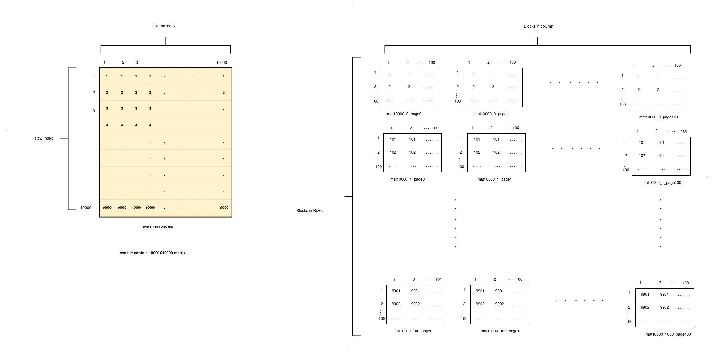
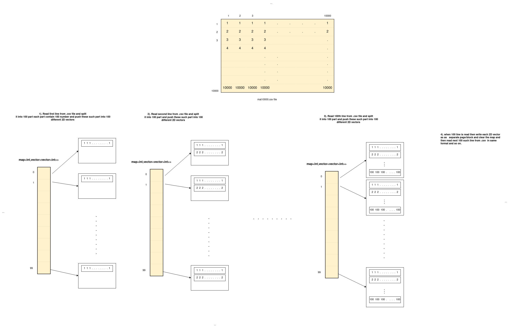
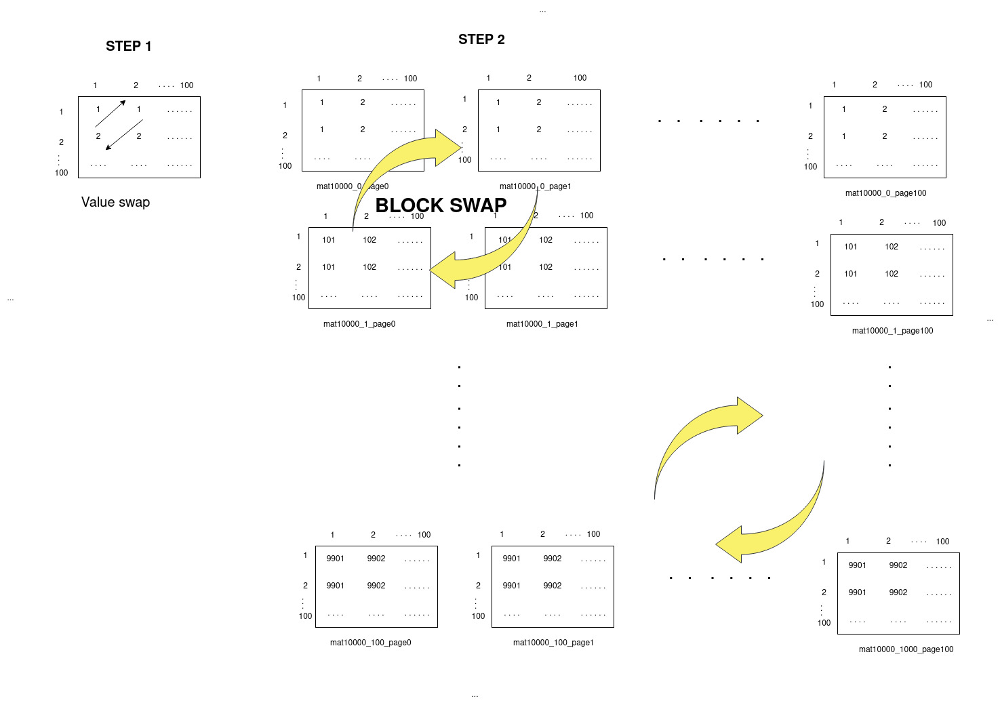
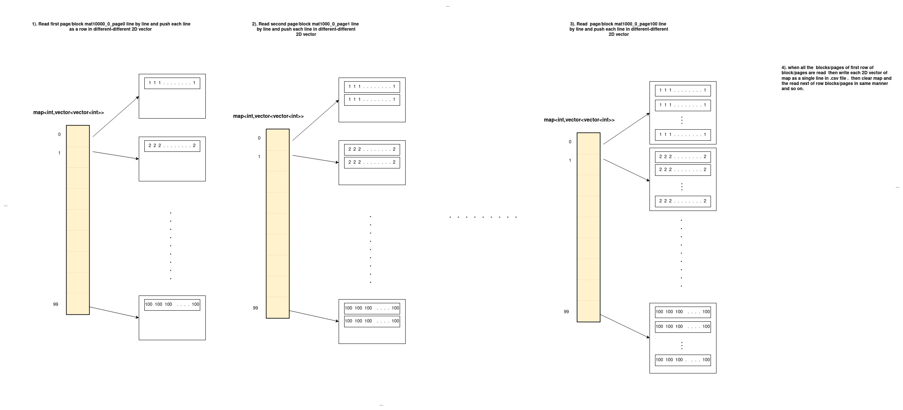
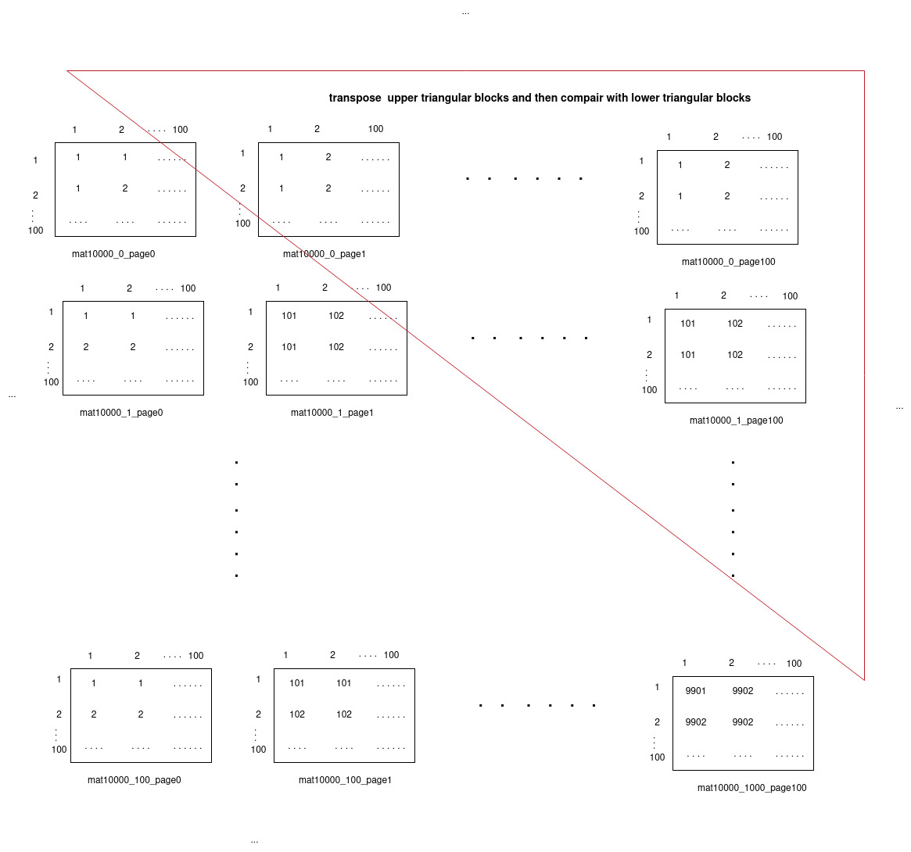

# Implementation Logic :
1. The implementation logic for storing the matrix is such that we divide the matrix into multiple submatrices where each submatrix is stored as 1 block/page. We have kept the page size such that each page can store submatrix of maximum 100x100 elements.  
2. So, for the largest input .csv file of nxn Square matrix where n=10<sup>4</sup> there will be 10<sup>4</sup> blocks to store the whole matrix. The matrix can be represented as blocks where there are 100 rows and columns of blocks. So, a single row of the square matrix will be stored in 100 such blocks for n=10<sup>4</sup>. Also, each block will store a part of 100 rows of the matrix.
3. If n <= 100 the whole matrix will be stored in a single block/page.
4. The page names are determined by the row and column index of the block in the matrix.





## LOAD 
 ### Command :
 ```LOAD MATRIX <MATRIX_NAME>```
 #### Command :
 LOAD MATRIX <MATRIX_NAME>
 #### Logic :
 1. While loading first we are reading .csv file line by line then we are dividing each line in parts of length equals to column size of block so that we can store each part as a row in seperate block. If the number of element in a row in .csv file is not a multiple of size of column of blocks then last block will have less number of column. 
 
 2. We are using a map with key as blockNumber in a row and a Two-dimensional matrix to store rows of that perticular block.

 3. We are doing in this way so that for eack block row write operation we would not have to load block in main memory.
```
 For example, For the matrix given above we have each block having 100 rows and 100 column so we create a map<int , vector<vector< int>>> to store blocks data in 2-d matrices with key as block number ( this key will varies from 0 to lineSize/ColumnCountOfBlock which is 100 in our example ). Now we divide first line of .csv file in 100 parts and store each part in seperate 2-d matrix as a first row of that block we repeat this process till maximum number of rows in our block( in our example it is 100 ) and then we create seperate page for storing each matrix as a block with naming as <matrixName_rowCountOfBlock_page_blockIndex> we repeat this process for remaining number of lines in .csv file 
 ```




 #### Number of block access :
Number of blocks read: 0

Number of blocks written: 10000

Number of blocks accessed: 10000

#### Error handling :
For error handling we have create syntactic parser and semantic parser which is checking syntex and semantic error respectively.


## PRINT

### Command :
```PRINT MATRIX < matrix_name >```  

#### Logic : 
Since we only have to print 20 rows and 20 column which is stored in first block of file so we only have to access first block of file. For accessing that block first we check if that block is exist in deque in BufferManager class which is a virtualized representation of main memory. if that block is not in buffermanager then we will load that block from secondary memory using indexing for ex. <matrixName_0_page_0>

#### Number of block access :
Number of blocks read: 1

Number of blocks written: 0

Number of blocks accessed: 1

#### Error handling :
For error handling we have create syntactic parser and semantic parser which is checking syntex and semantic error respectively.


## TRANSPOSE
#### Command :
```TRANSPOSE MATRIX < matrix_name >```  

#### Logic:
1. As in our implementation, we are storing the matrix in the form of submatrices, each submatrix in 1 block/page. To perform the transpose of the matrix we can now take tranpose of each submatrix/block independently and then take the transpose of the whole matrix represented as submatrices/blocks.
2. So, we traverse in the upper triangle of the matrix pick the block along with it's reflection in the lower triangle. Take the transpose of the elements in the 2 blocks and swap them in the matrix.
3. In the implementation we are storing the blocks with the row and column index so we just pick the blocks using filename and to swap we swap there filenames.



#### Block Access:
The number of blocks access in transpose are such that each block is access only twice once for read and then for write.  
For input size n=10<sup>4</sup>:  
Number of blocks read: 10000  
Number of blocks written: 10000  
Number of blocks accessed: 20000  

#### Error Handling:
We have implemented the syntacticParse and semanticParse functions of the command to handle the syntactic and semantic errors respectively.


## EXPORT

#### Command :
```EXPORT MATRIX < matrix_name >```  

#### Logic : 
1. For this command first we are reading all blocks in a row and load these blocks in a map which is similar to map explained in LOAD.
2. Now we read these 2-d matrices line by line and combine it to form a line in .csv file 




#### Number of block access :
Number of blocks read: 10000

Number of blocks written: 0

Number of blocks accessed: 10000

#### Error handling :
For error handling we have create syntactic parser and semantic parser which is checking syntex and semantic error respectively.


## RENAME
#### Command:
```RENAME MATRIX < old_matrix_name > < new_matrix_name >``` 

#### Logic : 
For Renaming first we are getting matrix pointer from matrixCatalogue using oldName then we rename each page of that matrix using rename(oldName,newName) in stdlib library. then finally we have changed metadata for that file(like matrix name ) in matrix catalogue.


#### Number of block access :
Number of blocks read: 0

Number of blocks written: 0

Number of blocks accessed: 0

#### Error Handling:
We have implemented the syntacticParse and semanticParse functions of the command to handle the syntactic and semantic errors respectively.


## CHECKSYMMETRY
#### Command:
```CHECKSYMMETRY < matrix_name >```  

#### Logic:
1. For checking the symmetry, we traverse over the upper triangle of matrix over the submatrices/blocks take transpose of the submatrix and check if it is equal to the submatrix in it's reflection in the lower triangle. This has to be equal for all such pair of blocks for the matrix to be symmetric.




#### Block Access:
For symmetric matrix of input size n=10<sup>4</sup>:  
Number of blocks read: 10000  
Number of blocks written: 0  
Number of blocks accessed: 10000 

#### Error Handling:
We have implemented the syntacticParse and semanticParse functions of the command to handle the syntactic and semantic errors respectively.


## COMPUTE 
#### Command:
```COMPUTE < matrix_name >```

#### Logic:
1. First we take a copy of the matrix and store with <matrix_name>_Result. Then we take transpose of this matrix.
2. After taking transpose we compute A - A_Result(A<sup>T</sup>) by picking block by block of both matrix take their subtraction and write back to the A_Result block.

#### Block Access:
For input size n=10<sup>4</sup>:  
Number of blocks read: 40000  
Number of blocks written: 30000  
Number of blocks accessed: 70000  

#### Error Handling:
We have implemented the syntacticParse and semanticParse functions of the command to handle the syntactic and semantic errors respectively.

## Assumptions
1. We have increased the page size such that it can include 100x100 elements of a submatrix. So, the page size becomes 100x100x4B = 40KB. (Approved with the TA)
2. For LOAD and EXPORT Commands we are retrieving multiple blocks into the main memory at the same time to optimize the block accesses. So, for the example of input size n=10<sup>4</sup> the maximum no. of blocks loaded in the main memory is 100. (Approved with TA and Doubt cleared in Doubt Document)


## Learnings
1. Loading large files by breaking it into multiple blocks and storing it.
2. Storing the matrix into smaller submatrices such that each Command is optimized in terms of block accesses. 
3. Learning of how to store and load large files(matrices) so that number of block accesses required are minimized.
4. Learning different way of taking transpose and checking symmetry of the matrix as the matrix is broken into smaller submatrices.
5. Learning to take transpose and check symmetry of matrix IN-PLACE.


## Contribution
#### Commands implemented by each member:
1. Vivek Kirpan - TRANSPOSE, CHECKSYMMETRY, COMPUTE
2. Udrasht Pal - EXPORT, PRINT
3. Dishant Sharma - LOAD, RENAME

#### Team Coordination:
We brainstormed the implementation logic and structure of the matrix and the commands. We then distributed the work amongst all the members and integrated the whole code. We discussed some common functionalities and implemented them together. All the team members have equally contributed to the project.